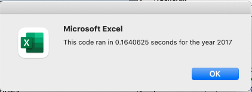
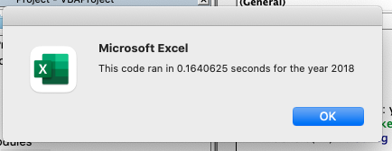
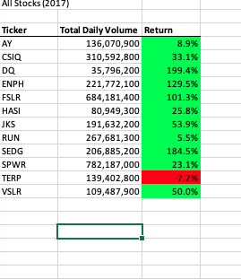
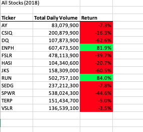

# Stock-Analysis
This project looks at trends between different green stocks. 
# Green Stock Analysis

## Project Overview

A friend named Steve has asked me to analysis a green stock for his parents to see if it is worth 
investing in. In order to do this, I needed to use the Visual Basic Appication in Excel to find the 
stock's total daily volume and annual return. After completing this analysis, I continued to analyze 
11 more green stocks to see how the first one compared to them. For there, I was able to use the
analysis to let Steve know what would be the best option for his parents.

### Purpose

The purpose of this project was to make an efficient way to look at multiple stocks using VBA. After 
being able to run the analysis of these 12 different stocks the first, it was apparent that there was 
a more efficient way to work with the data given. In order to make the analysis more efficient, I needed 
to refactor my code. This project looks to see if my refactoring made the analysis more efficient.

## Results

### Refactoring the Code

In order to make my code more efficient, I needed to switch the nesting order of my for loops. To do this,
I created a 4 different arrays; tickers, tickerVolumes, tickerStartingPrices, and tickerEndingPrices. 
The tickers array was used to establish the ticker symbol of a stock. I matched the other three arrays 
with the tickers array by using a variable called the tickerIndex. 

#### New Code
```
Option Base 0

Sub macro1()
    Dim yearValue As String: yearValue = "2017"
    'Initialize array of all tickers
    Dim tickers(11) As String
    
    startTime = Timer

    tickers(0) = "AY"
    tickers(1) = "CSIQ"
    tickers(2) = "DQ"
    tickers(3) = "ENPH"
    tickers(4) = "FSLR"
    tickers(5) = "HASI"
    tickers(6) = "JKS"
    tickers(7) = "RUN"
    tickers(8) = "SEDG"
    tickers(9) = "SPWR"
    tickers(10) = "TERP"
    tickers(11) = "VSLR"

    'Activate data worksheet
    Worksheets(yearValue).Activate

    'Get the number of rows to loop over
    RowCount = Cells(Rows.Count, "A").End(xlUp).Row

    '1a) Create a ticker Index
    tickerIndex = 0

    '1b) Create three output arrays
    Dim tickerVolumes(11) As Long
    Dim tickerStartingPrices(11) As Single
    Dim tickerEndingPrices(11) As Single


    ''2a) Create a for loop to initialize the tickerVolumes to zero.
    For i = 0 To 11
      tickerVolumes(i) = 0
      tickerStartingPrices(i) = 0
      tickerEndingPrices(i) = 0
    Next i

    'Activate sourca data worksheet
    Worksheets(yearValue).Activate
    Dim previousTickerIndex As Integer: previousTickerIndex = -1
    '2b) Loop over all the rows in the spreadsheet.
    For j = 2 To RowCount
    
        '3a) Increase volume for current ticker
        tickerVolumes(tickerIndex) = tickerVolumes(tickerIndex) + Cells(j, 8).value
        
        '3b) first row check
        If previousTickerIndex <> tickerIndex Then
               tickerStartingPrices(tickerIndex) = Cells(j, 6).value
        End If
    
        '3c) last row check
        If Cells(j, 1).value <> Cells(j + 1, 1).value Then
            tickerEndingPrices(tickerIndex) = Cells(j, 6).value
        End If
    
        '3d)
        previousTickerIndex = tickerIndex
        If Cells(j, 1).value <> Cells(j + 1, 1).value Then
             tickerIndex = tickerIndex + 1
        End If
    Next j
    
    '4) Loop through your arrays to output the Ticker, Total Daily Volume, and Return.
    'Format the output sheet on All Stocks Analysis worksheet
    Worksheets("All Stocks Analysis").Activate
    
    Range("A1").value = "All Stocks (" + yearValue + ")"
    
    'Create a header row
    Cells(3, 1).value = "Ticker"
    Cells(3, 2).value = "Total Daily Volume"
    Cells(3, 3).value = "Return"

    Worksheets("All Stocks Analysis").Activate
    
    For i = 0 To 11
        Cells(4 + i, 1).value = tickers(i)
        Cells(4 + i, 2).value = tickerVolumes(i)
        Cells(4 + i, 3).value = tickerEndingPrices(i) / tickerStartingPrices(i) - 1
    Next i
    
    'Formatting
    Worksheets("All Stocks Analysis").Activate
    Range("A3:C3").Font.FontStyle = "Bold"
    Range("A3:C3").Borders(xlEdgeBottom).LineStyle = xlContinuous
    Range("B4:B15").NumberFormat = "#,##0"
    Range("C4:C15").NumberFormat = "0.0%"
    Columns("B").AutoFit

    dataRowStart = 4
    dataRowEnd = 15
    
    For i = dataRowStart To dataRowEnd
        If Cells(i, 3) > 0 Then
            Cells(i, 3).Interior.Color = vbGreen
        Else
            Cells(i, 3).Interior.Color = vbRed
        End If
    Next i
    
    endTime = Timer
    MsgBox "This code ran in " & (endTime - startTime) & " seconds for the year " & (yearValue)
End Sub

```


This variable allowed me to assign the tickerVolumes, tickerStartingPrices, and tickerEndingPrices to 
each ticker symbol before interating through the data set. By doing it this way, the analysis would be 
completed much faster than using the nested for loop for earlier.

###


# Run-time for Each Method and yearValue
Here are the run-times using the original code.









# Summary on Refactoring

General thoughts on Refactoring
The major advantage of refactoring code is making the code more efficient. The major disadvantage of refactoring code is that you are taking code that already works and potential making it unusable if you can refactor it correctly. For that reason it is always smart to save your original code just incase you end up not being able to refactor it.

# Refactoring in VBA Script

The major advantage of refactoring code in VBA script is that you can use as much as of the original code as you want to and can put your new code side by side with your old code using different modules. The major disadvantage of refactoring code in VBA script is that if you do not have a strong understanding of the syntax, you will struggle to refactor your code as the syntax matters so much more when trying to make your code more efficient.

